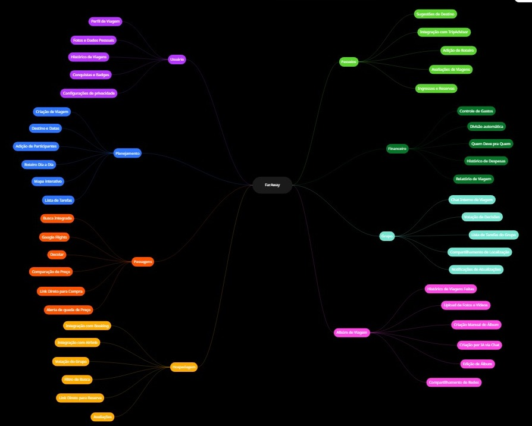

# FarAway 🌍

Plataforma digital de planejamento de viagens em grupo que centraliza toda a experiência — da organização à memória — em um único lugar.

---

## 🎯 Sobre o projeto

Trabalho acadêmico da disciplina de **Interfaces de Sistemas Computacionais** — UVA (Universidade Veiga de Almeida), com foco em UX/UI Design.

O FarAway nasceu de uma dor real: organizar viagens em grupo pelo WhatsApp é um caos. Decisões se perdem nas mensagens, ninguém sabe quanto gastou, e no final as memórias ficam esquecidas em pastas de foto no celular.

---

## ✨ Funcionalidades

- ✈️ **Busca de passagens** — integração com Google Flights, Decolar, entre outros sites.
- 🏨 **Hospedagem** — integração com Booking, Airbnb, entre outros sites, com votação do grupo.
- 🗺️ **Roteiro colaborativo** — planejamento dia a dia com mapa interativo
- 💰 **Divisão de gastos** — controle financeiro automático entre participantes
- 👥 **Chat e votação** — comunicação e decisões internas do grupo
- 📸 **Álbum inteligente** — gerado por IA a partir de fotos, vídeos e relatos

---

## 📦 Entregas do projeto

- [x] Brainstorming
- [x] Definição da empresa — missão, visão e valores
- [x] Mind Map
- [ ] Card Sorting
- [ ] Site Map
- [ ] Wireframe
- [ ] Protótipo navegável
---

## 🗺️ Mind Map

---

## 🛠️ Ferramentas utilizadas

---

## 🏫 Instituição

**Universidade Veiga de Almeida — UVA**  
Curso: Engenharia de Software  
Disciplina: Interfaces de Sistemas Computacionais
Período: 2026.1
